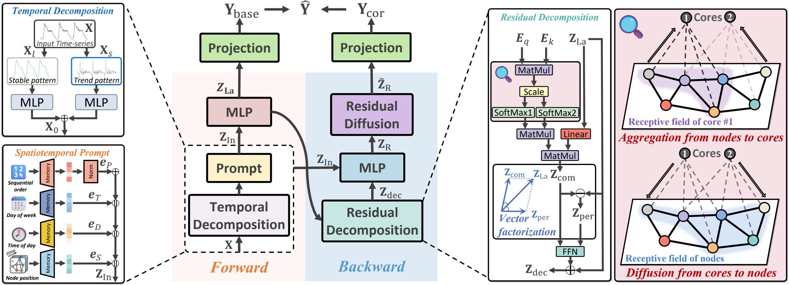

# BiST: An Lightweight and Efficient Bi-directional Model for Spatiotemporal Prediction (Submitted to VLDB 2025)
This is the official repository of our VLDB 2025 paper. This paper introduces BiST, a lightweight yet effective **Bi**-directional **S**patio-**T**emporal prediction model based on an MLP architecture, achieving competitive predictive performance while maintaining low computational complexity and memory usage. This model effectively captures inconsistencies between label and input information to enhance performance. We propose a novel spatiotemporal decoupling module that decomposes spatiotemporal features into node-shared context features and node-specific features. We evaluate the effectiveness of the model on over a dozen datasets, including large-spatial-scale and long-period datasets. Experimental results demonstrate the effectiveness, high training efficiency, and low memory burden of our model.

